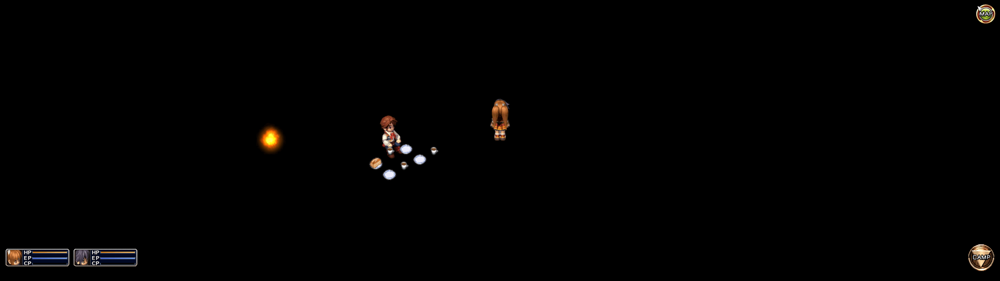

# The Legend of Heroes: Trails in the Sky Fix


Adds support for ultrawide resolutions and additional features.

***This project is designed exclusively for Windows due to its reliance on Windows-specific APIs. The build process requires the use of PowerShell.***

## Fixes
- Restores textures on aspect ratios greater than 21:9
- Increases tile render distance to prevent pop in/out above 21:9

## Features
- Adjust camera zoom to view less or more of the game world

## Build and Install
### Using CMake
1. Build and install:
```ps1
git clone --recurse-submodules https://github.com/PolarWizard/TrailsInTheSkyFix.git
cd TrailsInTheSkyFix; mkdir build; cd build
# If install is not needed you may omit -DCMAKE_INSTALL_PREFIX and cmake install step.
cmake -DCMAKE_GENERATOR_PLATFORM=Win32 -DCMAKE_INSTALL_PREFIX=<FULL-PATH-TO-GAME-FOLDER> ..
cmake --build .
cmake --install .
```

2. Download [dsound.dll](https://github.com/ThirteenAG/Ultimate-ASI-Loader/releases) Win32 version
3. Extract to game root folder: `Trails in the Sky <FC; SC; The 3rd>`

### Using Release
1. Download and follow instructions in [latest release](https://github.com/PolarWizard/TrailsInTheSkyFix/releases)

## Configuration
- Adjust settings in `Trails in the Sky <FC; SC; The 3rd>/scripts/TrailsInTheSkyFix.yml`

## Screenshots


## License
Distributed under the MIT License. See [LICENSE](LICENSE) for more information.

## External Tools
- [safetyhook](https://github.com/cursey/safetyhook)
- [spdlog](https://github.com/gabime/spdlog)
- [Ultimate ASI Loader](https://github.com/ThirteenAG/Ultimate-ASI-Loader)
- [yaml-cpp](https://github.com/jbeder/yaml-cpp)
- [zydis](https://github.com/zyantific/zydis)
